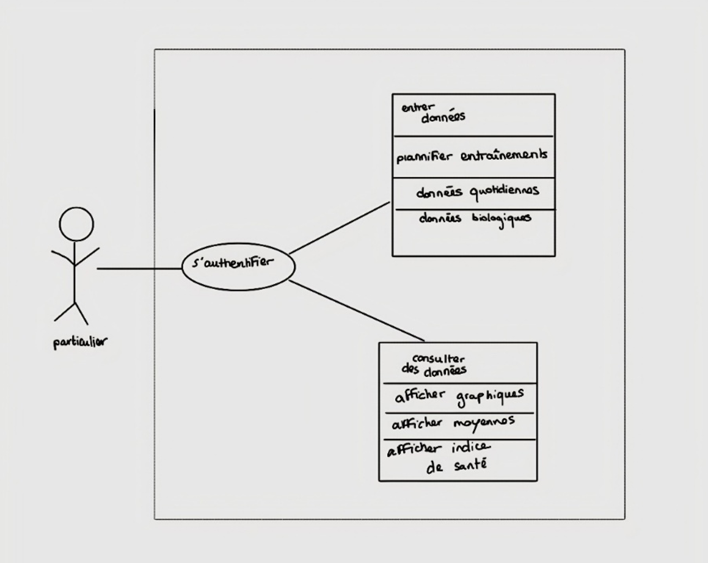
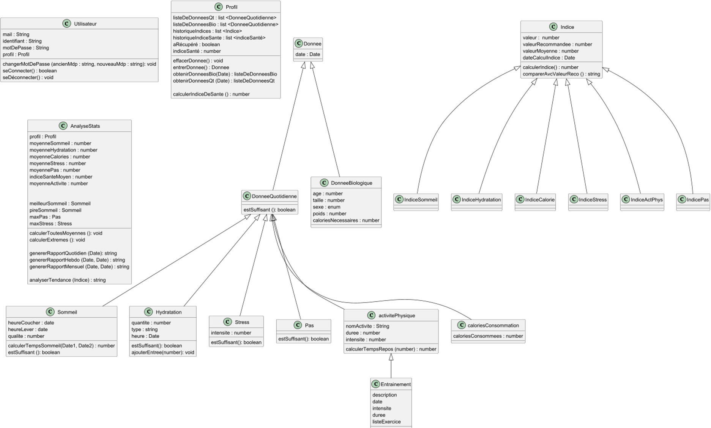
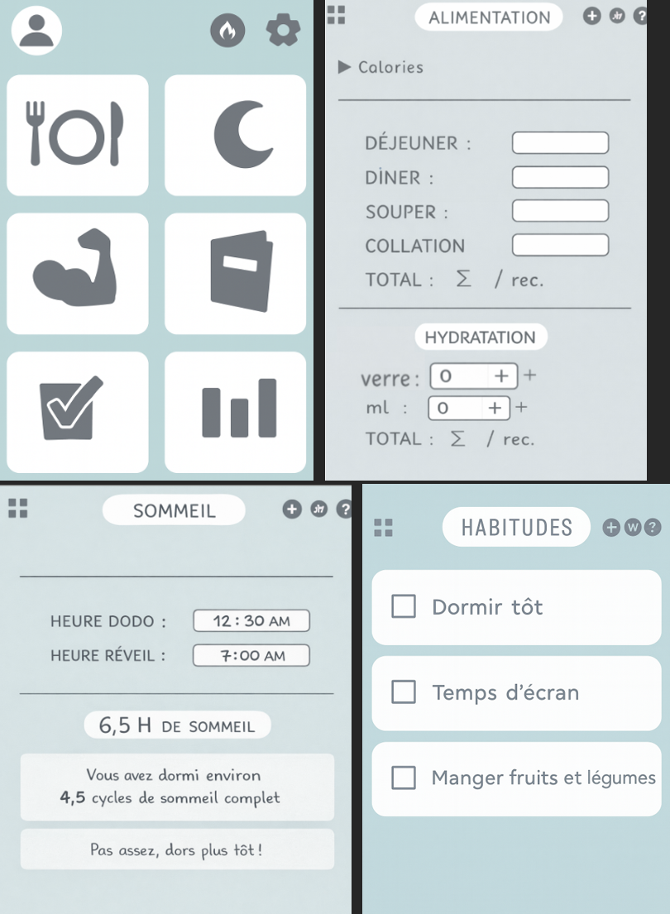
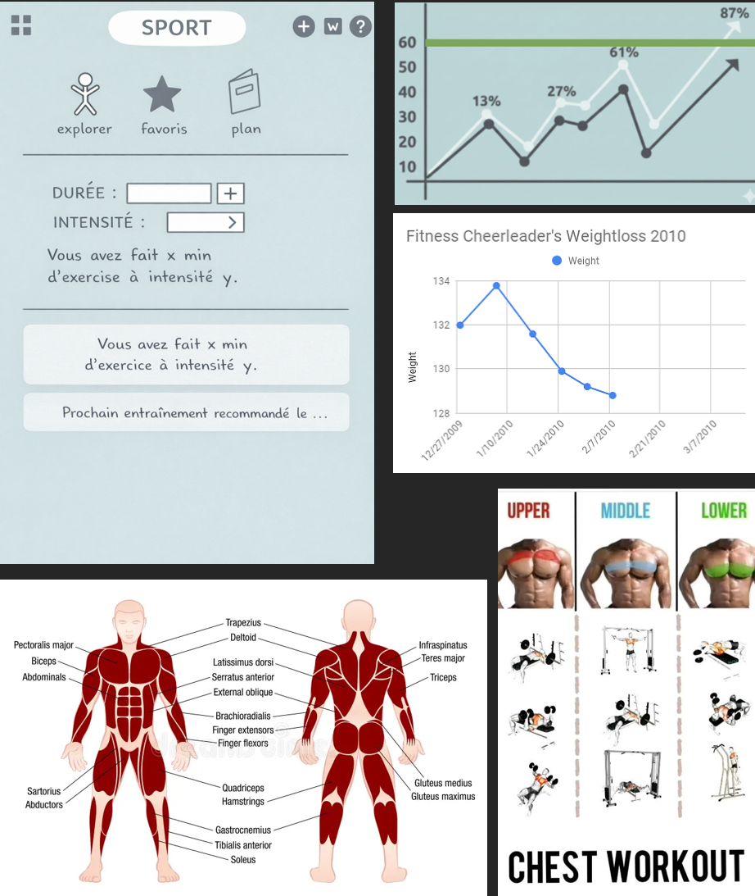

Bienvenue sur Salus!

➤ ➤ ➤ 1.	Description du projet 

1.1 Présentation de l’équipe
Rôles et responsabilités de chacun des membres :
•	BOUTALEB, Meryam : classe profil + design + UI

•	DROLET, Éloïse : classe donnée et ce qui en découle + classe analyse Stats

•	NSOULI Omar : indices santé + profil + onglet musculation

•	VERDONK Eléa : classe utilisateur dont authentification utilisateur + stockage de données

1.2 L’idée
En cours de conditionnement sportif au cours des dernières sessions, nous avons beaucoup discuté des habitudes de vie et nous avons remarqué qu’une vie plus saine repose seulement sur quelques habitudes. Or, en tant qu’étudiants, nous nous sommes rendu compte que nous sommes très peu conscients de ces habitudes, surtout lorsque nous sommes débordés par nos tâches et par une charge de travail élevée. 
Notre objectif est donc d’aider les utilisateurs à prendre conscience de leurs habitudes de vie, malgré qu’ils soient débordés, en les accompagnant pour qu’ils puissent intégrer quelques modifications dans leur quotidien sans qu'ils aient à reprogrammer leur emploi du temps déjà plein.

1.3 L’utilité
L’application se veut être un journal d’habitudes de vie dans lequel l’utilisateur est à la fois guidé pour intégrer de nouvelles routines, mais aussi libre de se donner ses propres objectifs. Afin d’encourager l’utilisateur et de souligner ses efforts, ses évolutions seront récompensées par des badges qu’il pourra collectionner.
Notre application résout le problème de la difficulté à maintenir, à comprendre et à ajuster ses habitudes dans un mode de vie occupé. Elle aidera les utilisateurs à prendre conscience de celles-ci afin qu’ils puissent améliorer leur qualité de vie. Lorsqu’on a un quotidien chargé, il est difficile de garder une vue d’ensemble sur ces aspects et de mesurer notre progression. Notre application vise donc à simplifier le suivi, à favoriser la prise de conscience et à aider à planifier ou à ajuster des habitudes existantes sans bouleverser la routine de l’utilisateur.

1.4 L’innovation
La nouveauté de Salus réside dans sa polyvalence. Contrairement à la plupart des applications qui se concentrent sur un seul aspect comme le sport, l’alimentation, l’hydratation, le suivi d’habitudes ou la journalisation, Salus réunit tous ces volets en une seule plateforme simple et intuitive. L’utilisateur peut ainsi suivre son sommeil, ses repas, son activité physique, son hydratation et ses habitudes de vie au même endroit.
Cette approche tout-en-un rend le processus beaucoup plus accessible et moins accablant pour ceux qui ont un quotidien chargé. En centralisant toutes ces dimensions du bien-être, Salus permet à l’utilisateur de conserver une vue d’ensemble sur sa progression sans avoir à jongler entre plusieurs applications.

1.5	Cas d’utilisation 

 
1.6 Public cible
Toute personne qui, dans son quotidien, se sent dépassée et souhaite se reconnecter avec elle-même et avec sa santé serait encline à utiliser cette application puisqu’elle va permettre de comprendre comment différentes variables du quotidien influencent le bien-être et la santé. Nous voulons qu’elle soit une application positive, accessible et motivante, qui propose des améliorations à la portée de tous, incluant ceux qui ne savent pas trop par où commencer pour apporter des changements positifs à leur quotidien ou qui trouvent la tâche trop grande pour se lancer.

1.7 Liens avec les autres matières
L’application est en lien en majorité avec les sciences de la santé et la biologie, car elle se concentre sur les impacts des habitudes de vie sur la santé humaine. De plus, l’application est en lien avec les mathématiques et les statistiques, car elle utilise plusieurs équations pour calculer des moyennes, des indices de variables et propose des corrélations entre diverses variables.

➤ ➤ ➤ 2.	Technologies utilisées

2.1 Outils et environnements
Pour programmer, nous avons décidé d’utiliser du TypeScript pour toute la partie logique et du JSX pour toute l’interface utilisateur combinée avec des éléments du React. L’application sera lancée avec Expo. La base de données que nous allons utiliser est Node.js. Pour avoir un émulateur Android, nous allons utiliser Android Studio. Au niveau de l’IDE, nous allons utiliser Visual Code Studio. Enfin, pour collaborer, nous allons utiliser GitHub. Nous cherchons également une API qui contient des exercices pour toute la partie corps humain interactif - recommandation d’exercices.

2.2 Justifications
Nous avons décidé d’utiliser TypeScript, car le langage permet de pouvoir définir les types de variables dont nous avons besoin pour construire la logique de notre application, contrairement à JavaScript. Cela nous permet de coder plus facilement avec la logique que nous avons apprise durant les derniers cours de programmation. Pour l’interface utilisateur, utiliser React Native avec du JSX permet de nous simplifier l’appel aux éléments natifs qui composent une interface mais aussi d’avoir de nombreuses librairies à portée de main. Visual Code studio nous paraissait l’IDE la plus pertinente, car c’est une IDE très utilisée avec laquelle il est très facile de travailler avec de nombreux langages. Au niveau de l’utilisation de Node.js, cela nous paraissait être la base de données la plus adaptée pour pouvoir programmer en Javascript et plus précisément en TypeScript comme il s’agit du langage nous allons travailler avec. Enfin, Expo était recommandé avec l’utilisation de React Native, ce qui va fortement faciliter notre tâche pour lancer notre application avec une simple commande dans le terminal. Enfin, pour obtenir un émulateur Android, nous allons travailler avec Android Studio.

2.3 Défis et difficultés
Les principales difficultés du projet concernent l’apprentissage et l’utilisation de nouvelles technologies, notamment les langages TypeScript et JSX, ainsi que React Native et Expo pour le développement d’une interface utilisateur complète et fonctionnelle. L’intégration et l’utilisation correcte de données scientifiques issues des sciences de la santé représentent également un défi important, tout comme l’apprentissage de l’utilisation d’une API, puisque nous n’en avons jamais utilisée auparavant. Enfin, la réalisation d’un projet concret et complet dans un temps limité, tout en respectant le rythme des autres cours, constitue une difficulté supplémentaire qui nécessite une bonne organisation et une répartition efficace des tâches au sein de l’équipe.

➤ ➤ ➤ 3. Plan de travail en équipe

3.1 Echéancier
Diagramme de Gantt-Salus.xlsx

3.2 Analyse du projet
Enjeux :

•	Créer une application non culpabilisante pour aider l’utilisateur à faire un premier pas vers une vie plus saine ;

•	Accompagner l’utilisateur dans une pratique sécuritaire du sport.

Contraintes : 

•	S’assurer de ne pas laisser l’application devenir toxique, afin qu’elle ne génère pas ou n’encourage pas des comportements obsessionnels, que ce soient des troubles alimentaires ou une psychose sur les habitudes de vie ;

•	Utiliser des sources scientifiques fiables pour les habitudes de vies et les sciences de la santé ;

•	Proposer des exercices qui sont sains pour les utilisateurs, qui sont sans danger et qui leur permet d’éviter un surmenage.

3.3 Diagramme UML

3.4 Vues de l’application
Voici les vues principales de l’applications :

➤ ➤ ➤ 4. Conclusion
En résumé, notre application est un point de départ pour toute personne souhaitant comprendre comment ses habitudes influencent sa vie quotidienne et comment elle peut changer quelques habitudes. L’application permet d’accompagner la personne qui n’a pas forcément de connaissances sur les liens entre habitudes de vie et santé et de comprendre comment les exercices influencent les différentes parties du corps. Elle accompagne la personne dans la pratique d’une activité physique, tout en privilégiant sa santé et sa sécurité.

Les prochaines étapes seront de terminer une répartition claire des tâches, puis de commencer à programmer toute la logique de l’application tout en découvrant comment utiliser React-Native, Expo et TypeScript. Nous continuerons de réfléchir à des potentielles améliorations.
